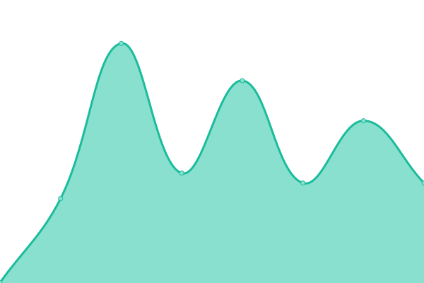
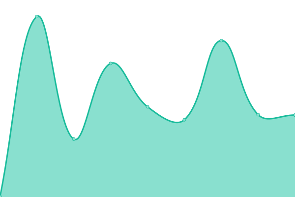

# [📈 Live Status](https://ilstax.github.io/boz-status): <!--live status--> **🟧 Partial outage**

This repository contains the open-source uptime monitor and status page for [Upptime](https://upptime.js.org), powered by [Upptime](https://github.com/upptime/upptime).

With [Upptime](https://upptime.js.org), you can get your own unlimited and free uptime monitor and status page, powered entirely by a GitHub repository. We use [Issues](https://github.com/ilstax/boz-status/issues) as incident reports, [Actions](https://github.com/ilstax/boz-status/actions) as uptime monitors, and [Pages](https://ilstax.github.io/boz-status) for the status page.

<!--start: status pages-->
<!-- This summary is generated by Upptime (https://github.com/upptime/upptime) -->
<!-- Do not edit this manually, your changes will be overwritten -->
<!-- prettier-ignore -->
| URL | Status | History | Response Time | Uptime |
| --- | ------ | ------- | ------------- | ------ |
|  [Bournout Zero](https://www.burnout-zero.com) | 🟩 Up | [bournout-zero.yml](https://github.com/iLStAx/boz-status/commits/HEAD/history/bournout-zero.yml) | 

 352ms
     
 | 

<a href="https://ilstax.github.io/boz-status/history/bournout-zero">100.00%</a>
    

|  [App Burnout Zero](https://app.burnout-zero.com) | 🟩 Up | [app-burnout-zero.yml](https://github.com/iLStAx/boz-status/commits/HEAD/history/app-burnout-zero.yml) | 

 397ms
     
 | 

<a href="https://ilstax.github.io/boz-status/history/app-burnout-zero">100.00%</a>
    

|  [Dev Burnout Zero](https://dev.burnout-zero.com) | 🟩 Up | [dev-burnout-zero.yml](https://github.com/iLStAx/boz-status/commits/HEAD/history/dev-burnout-zero.yml) | 

 380ms
     
 | 

<a href="https://ilstax.github.io/boz-status/history/dev-burnout-zero">100.00%</a>
    

|  [Back-dev Burnout Zero](https://back-dev.burnout-zero.com/healthz) | 🟩 Up | [back-dev-burnout-zero.yml](https://github.com/iLStAx/boz-status/commits/HEAD/history/back-dev-burnout-zero.yml) | 

 634ms
     
 | 

<a href="https://ilstax.github.io/boz-status/history/back-dev-burnout-zero">100.00%</a>
    

|  [Staging Burnout Zero](https://staging.burnout-zero.com) | 🟥 Down | [staging-burnout-zero.yml](https://github.com/iLStAx/boz-status/commits/HEAD/history/staging-burnout-zero.yml) | 

 0ms
     
 | 

<a href="https://ilstax.github.io/boz-status/history/staging-burnout-zero">0.00%</a>
    

|  [Staging-dev Burnout Zero](https://back-staging.burnout-zero.com/healthz) | 🟥 Down | [staging-dev-burnout-zero.yml](https://github.com/iLStAx/boz-status/commits/HEAD/history/staging-dev-burnout-zero.yml) | 

 0ms
     
 | 

<a href="https://ilstax.github.io/boz-status/history/staging-dev-burnout-zero">0.00%</a>
    

|  [Prod Back Burnout Zero](https://back.burnout-zero.com/healthz) | 🟩 Up | [prod-back-burnout-zero.yml](https://github.com/iLStAx/boz-status/commits/HEAD/history/prod-back-burnout-zero.yml) | 

 613ms
     
 | 

<a href="https://ilstax.github.io/boz-status/history/prod-back-burnout-zero">100.00%</a>
    

<!--end: status pages-->

[**Visit boz-status website →**](https://ilstax.github.io/boz-status/)

## 📄 License

- Powered by: [Upptime](https://github.com/upptime/upptime)
- Code: [MIT](./LICENSE) © [Upptime](https://upptime.js.org)
- Data in the `./history` directory: [Open Database License](https://opendatacommons.org/licenses/odbl/1-0/)
